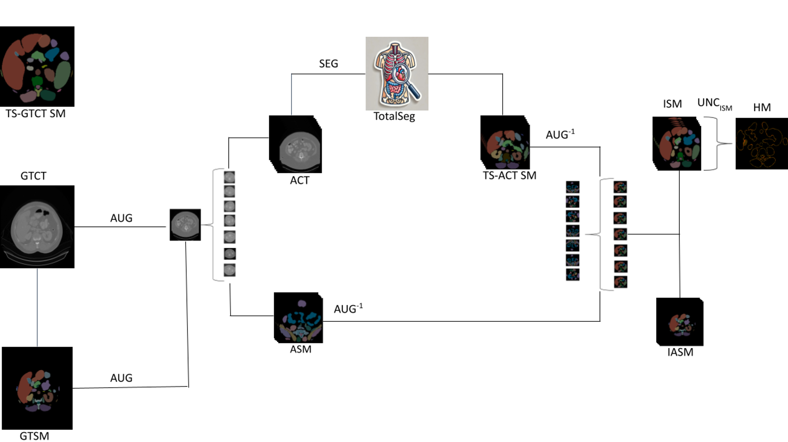

# Evaluating Medical Image Segmentation Models using Augmentation
[Mattin Sayed]()<sup>1</sup>,[Sari Saba-Sadiya]()<sup>2</sup>,
[Benedikt Wichtlhuber]()<sup>1</sup>,
[ Julia Dietz]()<sup>1</sup>,
[Matthias Neitzel]()<sup>1</sup>,
[Leopold Keller]()<sup>1</sup>,
[Gemma Roig]()<sup>2</sup>,
[Andreas Bucher]()<sup>1</sup><br>
<sup>1</sup>Goethe University Frankfurt, University Hospital, Clinic for Radiology and Nuclear Medicine, Germany<sup>2</sup> Goethe University Frankfurt, University Department of Informatics

Code for the paper ["Evaluating Medical Image Segmentation Models using
Augmentation"](). The data can be downloaded from the following link: https://osf.io/6cmqt/?view_only=5081585fe1704f698ef8ca17a977a1b4

## Overview:
The code implemented here can be used to predict the quality of a CT segmentation scan using agreement with segmentation masks for augmnetation scans. 



## Contents:
* `augmentation_script.ipynb`:  This script handles the inversion of the segmentation masks of the augmented CT-scans back to the affine of the ground truth segmentation masks.
* `inverse_augmentations_script.ipynb`:  This script handles the augmentation of CT scans and segmentation masks. As a prerequisite, the user must provide the ground truth CT scan files as well as the corresponding ground truth segmentation masks.
* `uncertainty_heatmap_script.ipynb`:  This script handles the generation of uncertainty heatmaps.
* `[OSF Data](https://osf.io/6cmqt/?view_only=5081585fe1704f698ef8ca17a977a1b4)`:  
    * `ACT`: Examples of CT scan augmentations for all three levels  
    * `GTCT`: Original CT scan
    * `GTSM`: Original scan segmnetation mask
    * `ISM`: Inverted CT scans segmentation masks
    * `TS_ACT_SM`:  TotalSegmentator segmentation mask
* `README.md`: This file.

## Cite
```
@Misc{Sayed_2024,
  author={Mattin Sayed, Sari Saba-Sadiya, Benedikt Wichtlhuber, Julia Dietz, Matthias Neitzel, Leopold Keller, Gemma Roig, and Andreas M. Bucher},
  booktitle={ArXiv}, 
  title={Evaluating Medical Image Segmentation Models using
Augmentation}, 
  year={2024}
}
```

